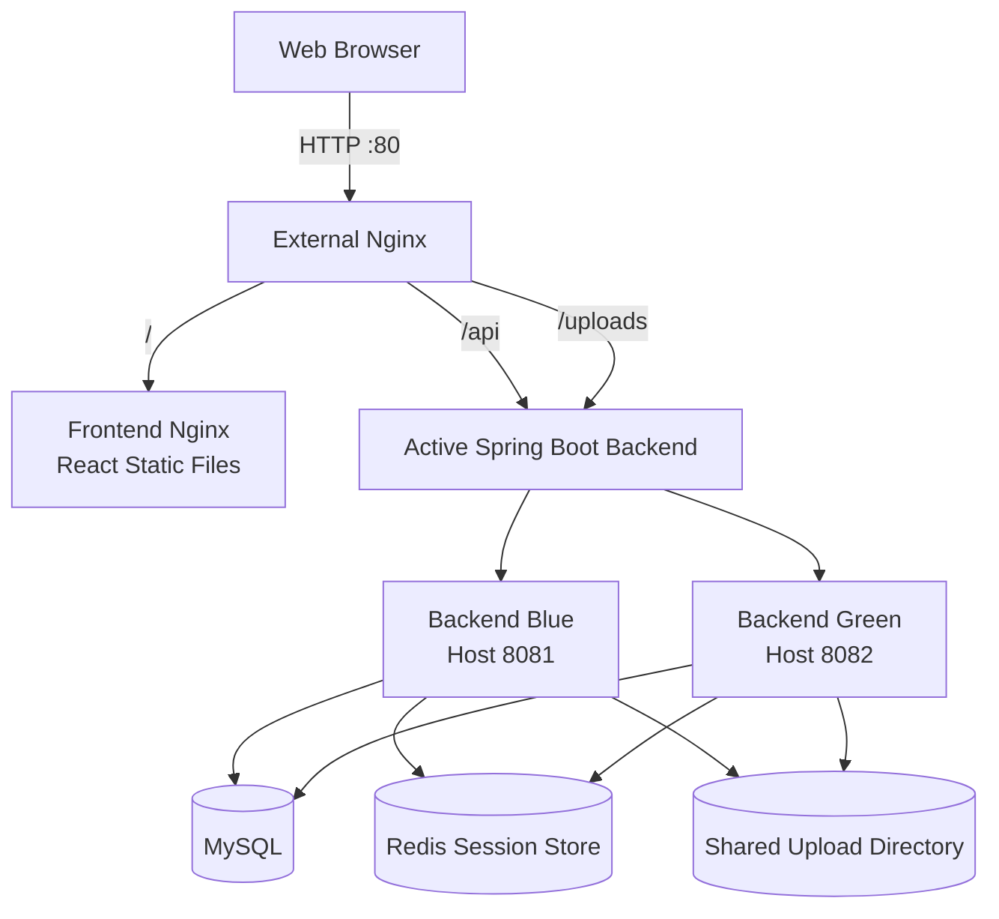

# JihunPage

## Overview

JihunPage is a full-stack member-based gallery service built with React and Spring Boot.

The project began as a React personal introduction page and was gradually expanded to include member registration, session-based authentication, member-specific public galleries, and image upload and deletion features.

MySQL is used for persistent application data, while Redis stores shared HTTP sessions so that login states remain valid when traffic is switched between Blue and Green backend instances.

The application is containerized with Docker, served through Nginx, tested with GitHub Actions, distributed through GHCR as AMD64 and ARM64 images, and deployed to an ARM64-based AWS EC2 instance.

## Key Features

### Member Authentication

- Member registration with server-side validation
- BCrypt password hashing
- Session-based login and logout
- Authentication state restoration after page refresh
- React Context-based authentication state management

### Member Gallery

- Public gallery page for each member
- Gallery URL based on the member ID
- Image upload to the authenticated member's own gallery
- Image deletion restricted to the photo owner
- Image detail view using a modal
- Persistent image storage through a Docker bind mount

### Shared Session Management

- HTTP sessions stored in Redis through Spring Session
- Shared login state between Blue and Green backend instances
- Session preservation during backend traffic switching

### Deployment and Operations

- Dockerized frontend, backend, MySQL, Redis, and Nginx
- Nginx as the single entry point for frontend, API, and uploaded images
- Automated frontend checks and backend tests with GitHub Actions
- Multi-architecture image publishing to GHCR
- Blue-Green deployment and rollback scripts
- Production deployment and verification on AWS EC2

## Architecture

### Project Structure

```text
JihunPage/
├── frontend/
├── backend/
├── nginx/
├── scripts/
├── docs/
├── .github/workflows/
├── compose.yaml
├── compose.prod.yaml
├── compose.deploy.yaml
└── README.md
```

- `frontend`: React application and production frontend image
- `backend`: Spring Boot application and gallery image storage directory
- `nginx`: Reverse proxy and Blue-Green upstream configuration
- `scripts`: Deployment, health check, traffic switching, and rollback scripts
- `docs`: Detailed project and deployment documentation
- `.github/workflows`: CI and GHCR image publishing workflows
- `compose.yaml`: Local development environment
- `compose.prod.yaml`: Production-style container environment
- `compose.deploy.yaml`: GHCR image-based EC2 deployment environment

### Production Request Flow



Nginx acts as the single entry point for all external requests.

The frontend is served as static files from a dedicated Nginx container. API and uploaded image requests are forwarded to the currently active Spring Boot backend.

Blue and Green backends share the same MySQL database, Redis session store, and upload directory. This allows application data, uploaded images, and login sessions to remain available when traffic is switched between backend environments.

## Technology Stack

### Frontend

| Technology    | Version / Purpose                       |
| ------------- | --------------------------------------- |
| React         | `19`                                    |
| JavaScript    | Frontend application logic              |
| Vite          | Development server and production build |
| Bootstrap     | `5`, responsive UI                      |
| React Router  | Client-side routing                     |
| React Context | Authentication state management         |
| ESLint        | Static code analysis                    |
| Nginx         | Production static file serving          |

### Backend

| Technology                | Version / Purpose               |
| ------------------------- | ------------------------------- |
| Java                      | `21`                            |
| Spring Boot               | `3.5.16`                        |
| Spring Web                | REST API development            |
| Spring Data JPA           | Database access and persistence |
| Spring Validation         | Request validation              |
| Spring Session Data Redis | Shared HTTP session storage     |
| BCrypt                    | Password hashing                |
| Gradle                    | `8.14.3`, build automation      |

### Data and Storage

| Technology        | Version / Purpose                     |
| ----------------- | ------------------------------------- |
| MySQL             | `8.4.10`, persistent application data |
| Redis             | `7.4.9`, shared session storage       |
| Local File System | Uploaded gallery image storage        |
| Docker Volume     | Database data persistence             |
| Bind Mount        | Uploaded image persistence            |

### Infrastructure and Deployment

| Technology                | Purpose                                 |
| ------------------------- | --------------------------------------- |
| Docker                    | Containerized execution environment     |
| Docker Compose            | Multi-container orchestration           |
| Nginx                     | Reverse proxy and traffic switching     |
| GitHub Actions            | CI and image publishing automation      |
| GitHub Container Registry | Frontend and backend image distribution |
| Docker Buildx             | Multi-architecture image builds         |
| QEMU                      | ARM64 and AMD64 cross-platform builds   |
| AWS EC2                   | Production server                       |
| Amazon Linux 2023         | EC2 operating system                    |

## Authentication and Session Management

## Blue-Green Deployment

## CI and Image Publishing

## AWS Deployment

## Screenshots

## Local Development

Create a local `.env` file based on `.env.example`.

```bash
cp .env.example .env
```

Update the MySQL credentials in `.env`.

```dotenv
MYSQL_DATABASE=jihunpage
MYSQL_USER=your_mysql_user
MYSQL_PASSWORD=your_mysql_password
MYSQL_ROOT_PASSWORD=your_mysql_root_password
```

Start the application from the project root:

```bash
docker compose up --build
```

To run the containers in the background:

```bash
docker compose up -d --build
```

After the containers start, open the application through Nginx:

```text
http://localhost
```

The following service addresses are available in the development environment:

| Service     | URL                         | Purpose                              |
| ----------- | --------------------------- | ------------------------------------ |
| Application | http://localhost            | Main application entry point         |
| Frontend    | http://localhost:5173       | Direct frontend access for debugging |
| Backend     | http://localhost:8080       | Direct backend access for debugging  |
| Health API  | http://localhost/api/health | Health check through Nginx           |
| MySQL       | localhost:3306              | Application database                 |
| Redis       | localhost:6379              | HTTP session storage                 |

Stop the application:

```bash
docker compose down
```

MySQL data and Redis session data remain in Docker named volumes after running `docker compose down`.

The following command also deletes the MySQL and Redis named volumes:

```bash
docker compose down -v
```

## Production Deployment

## Testing

## Documentation

- [Docker Development Environment](docs/docker-development.md)
- [Manual Blue-Green Deployment](./docs/blue-green-deployment.md)
- [Production Docker Environment](./docs/production-docker.md)
- [Blue-Green Deployment Automation](./docs/blue-green-automation.md)
- [AWS EC2 Deployment Guide](docs/aws-ec2-deployment.md)

## Limitations and Future Improvements

## Development Workflow

Frontend source changes are automatically reflected through Vite HMR.

After changing backend source code, restart the backend container:

```bash
docker compose restart backend
```

View all container logs:

```bash
docker compose logs -f
```

View backend logs:

```bash
docker compose logs -f backend
```

View MySQL logs:

```bash
docker compose logs -f mysql
```

View Redis logs:

```bash
docker compose logs -f redis
```

View Nginx logs:

```bash
docker compose logs -f nginx
```

## Run Manually

The frontend and backend can also be started without Docker.

MySQL and Redis servers must already be running before starting the backend manually.

### Run the Backend

Move to the backend directory:

````bash
cd backend
```

Set the database and Redis connection environment variables:

```bash
export SPRING_DATASOURCE_URL="jdbc:mysql://localhost:3306/jihunpage"
export SPRING_DATASOURCE_USERNAME="your_mysql_user"
export SPRING_DATASOURCE_PASSWORD="your_mysql_password"
export SPRING_DATA_REDIS_HOST="localhost"
export SPRING_DATA_REDIS_PORT="6379"
````

Run the tests:

```bash
./gradlew test
```

Start the Spring Boot application:

```bash
./gradlew bootRun
```

The backend server runs at:

```text
http://localhost:8080
```

### Run the Frontend

Open another terminal and move to the frontend directory:

```bash
cd frontend
```

Install the dependencies:

```bash
npm install
```

Start the Vite development server:

```bash
npm run dev
```

The frontend development server runs at:

```text
http://localhost:5173
```

## Health Check

Send a request to the following endpoint:

```text
GET http://localhost/api/health
```

Expected response:

```json
{
  "status": "UP"
}
```

## Data and Session Persistence

MySQL data is stored in the `mysql_data` Docker named volume.

Member and gallery database records remain after restarting the backend:

```bash
docker compose restart backend
```

HTTP sessions are stored in Redis instead of the backend application's memory.

Therefore, the authenticated session also remains after restarting the backend container:

```bash
docker compose restart backend
```

The database records and Redis session data remain after stopping and recreating the containers:

```bash
docker compose down
docker compose up -d
```

Uploaded gallery image files are stored in the local `backend/uploads` directory.

The following command deletes the MySQL and Redis named volumes:

```bash
docker compose down -v
```
