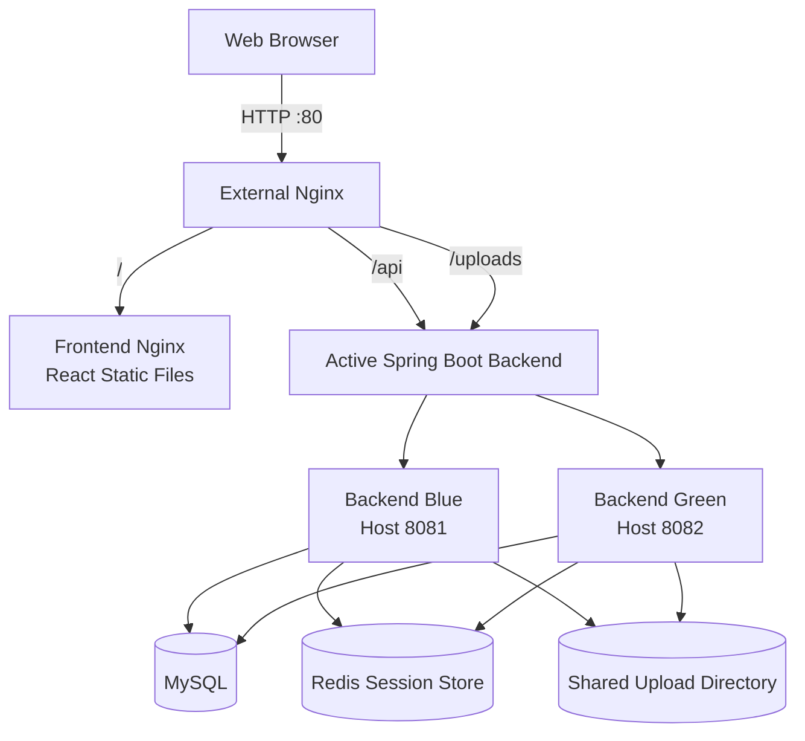

# JihunPage

## Overview

JihunPage is a full-stack member-based gallery service built with React and Spring Boot.

The project began as a React personal introduction page and was gradually expanded to include member registration, session-based authentication, member-specific public galleries, and image upload and deletion features.

MySQL is used for persistent application data, while Redis stores shared HTTP sessions so that login states remain valid when traffic is switched between Blue and Green backend instances.

The application is containerized with Docker, served through Nginx, tested with GitHub Actions, distributed through GHCR as AMD64 and ARM64 images, and deployed to an ARM64-based AWS EC2 instance.

## Key Features

### Member Authentication

- Member registration with server-side validation
- BCrypt password hashing
- Session-based login and logout
- Authentication state restoration after page refresh
- React Context-based authentication state management

### Member Gallery

- Public gallery page for each member
- Gallery URL based on the member ID
- Image upload to the authenticated member's own gallery
- Image deletion restricted to the photo owner
- Image detail view using a modal
- Persistent image storage through a Docker bind mount

### Shared Session Management

- HTTP sessions stored in Redis through Spring Session
- Shared login state between Blue and Green backend instances
- Session preservation during backend traffic switching

### Deployment and Operations

- Dockerized frontend, backend, MySQL, Redis, and Nginx
- Nginx as the single entry point for frontend, API, and uploaded images
- Automated frontend checks and backend tests with GitHub Actions
- Multi-architecture image publishing to GHCR
- Blue-Green deployment and rollback scripts
- Production deployment and verification on AWS EC2

## Architecture

### Project Structure

```text
JihunPage/
├── frontend/
├── backend/
├── nginx/
├── scripts/
├── docs/
├── .github/workflows/
├── compose.yaml
├── compose.prod.yaml
├── compose.deploy.yaml
└── README.md
```

- `frontend`: React application and production frontend image
- `backend`: Spring Boot application and gallery image storage directory
- `nginx`: Reverse proxy and Blue-Green upstream configuration
- `scripts`: Deployment, health check, traffic switching, and rollback scripts
- `docs`: Detailed project and deployment documentation
- `.github/workflows`: CI and GHCR image publishing workflows
- `compose.yaml`: Local development environment
- `compose.prod.yaml`: Production-style container environment
- `compose.deploy.yaml`: GHCR image-based EC2 deployment environment

### Production Request Flow



Nginx acts as the single entry point for all external requests.

The frontend is served as static files from a dedicated Nginx container. API and uploaded image requests are forwarded to the currently active Spring Boot backend.

Blue and Green backends share the same MySQL database, Redis session store, and upload directory. This allows application data, uploaded images, and login sessions to remain available when traffic is switched between backend environments.

## Technology Stack

### Frontend

| Technology    | Version / Purpose                       |
| ------------- | --------------------------------------- |
| React         | `19`                                    |
| JavaScript    | Frontend application logic              |
| Vite          | Development server and production build |
| Bootstrap     | `5`, responsive UI                      |
| React Router  | Client-side routing                     |
| React Context | Authentication state management         |
| ESLint        | Static code analysis                    |
| Nginx         | Production static file serving          |

### Backend

| Technology                | Version / Purpose               |
| ------------------------- | ------------------------------- |
| Java                      | `21`                            |
| Spring Boot               | `3.5.16`                        |
| Spring Web                | REST API development            |
| Spring Data JPA           | Database access and persistence |
| Spring Validation         | Request validation              |
| Spring Session Data Redis | Shared HTTP session storage     |
| BCrypt                    | Password hashing                |
| Gradle                    | `8.14.3`, build automation      |

### Data and Storage

| Technology        | Version / Purpose                     |
| ----------------- | ------------------------------------- |
| MySQL             | `8.4.10`, persistent application data |
| Redis             | `7.4.9`, shared session storage       |
| Local File System | Uploaded gallery image storage        |
| Docker Volume     | Database data persistence             |
| Bind Mount        | Uploaded image persistence            |

### Infrastructure and Deployment

| Technology                | Purpose                                 |
| ------------------------- | --------------------------------------- |
| Docker                    | Containerized execution environment     |
| Docker Compose            | Multi-container orchestration           |
| Nginx                     | Reverse proxy and traffic switching     |
| GitHub Actions            | CI and image publishing automation      |
| GitHub Container Registry | Frontend and backend image distribution |
| Docker Buildx             | Multi-architecture image builds         |
| QEMU                      | ARM64 and AMD64 cross-platform builds   |
| AWS EC2                   | Production server                       |
| Amazon Linux 2023         | EC2 operating system                    |

## Authentication and Session Management

JihunPage uses server-side HTTP sessions instead of JWT-based authentication.

### Authentication Flow

1. The user submits a user ID and password from the React application.
2. The frontend sends a login request to the Spring Boot API.
3. The backend verifies the password using BCrypt.
4. The authenticated member ID is stored in the HTTP session.
5. Spring Session stores the session data in Redis.
6. The browser stores the generated `SESSION` cookie.
7. Subsequent requests use the cookie to restore the authenticated user.

The authenticated member ID is stored using the following session attribute:

```text
LOGIN_MEMBER_ID
```

The Redis session namespace is:

```text
jihunpage:session
```

### Main Authentication APIs

| Method | Endpoint           | Purpose                           |
| ------ | ------------------ | --------------------------------- |
| `POST` | `/api/members`     | Register a new member             |
| `POST` | `/api/auth/login`  | Log in and create a session       |
| `POST` | `/api/auth/logout` | Invalidate the current session    |
| `GET`  | `/api/auth/me`     | Retrieve the authenticated member |

### Why Redis Is Used

If each backend stored sessions only in its own memory, a session created by Blue would not be available after traffic switched to Green.

Both backend instances therefore use the same Redis session store. This allows the login state to remain valid during Blue-Green traffic switching.

The React application uses Context to manage authentication state and calls `/api/auth/me` when the application is loaded. This restores the logged-in member after a page refresh when a valid session exists.

## Blue-Green Deployment

JihunPage uses two Spring Boot backend containers to reduce service interruption during deployment.

- `backend-blue`: EC2 host port `8081`
- `backend-green`: EC2 host port `8082`

Only one backend receives external traffic at a time. Nginx forwards `/api` and `/uploads` requests to the currently active backend.

### Deployment Flow

1. Detect the currently active and inactive environments.
2. Pull the new backend image from GHCR.
3. Recreate only the inactive backend with the new image.
4. Perform an HTTP health check on the inactive backend.
5. Verify the expected `X-Backend-Instance` response header.
6. Update the Nginx upstream configuration.
7. Run `nginx -t` to validate the configuration.
8. Reload Nginx and switch external traffic.
9. Verify the backend instance through the external endpoint.
10. Restore the previous Nginx configuration if verification fails.

The automated deployment is executed with:

```bash
./scripts/deploy.sh
```

The currently active environment can be checked with:

```bash
./scripts/detect-environment.sh active
```

The backend response includes an instance-identification header:

```text
X-Backend-Instance: backend-blue
```

or:

```text
X-Backend-Instance: backend-green
```

### Shared State Between Environments

Blue and Green share the same MySQL database, Redis session store, and upload directory.

Because the session data is stored in Redis, users remain logged in after traffic is switched between the backend environments. Database records and uploaded gallery images also remain available after deployment.

### Rollback

If the newly activated backend fails after deployment, traffic can be returned to the previous environment with:

```bash
./scripts/rollback.sh
```

During normal operation, the inactive backend is stopped to reduce memory usage on the `t4g.small` EC2 instance. Both environments run simultaneously only during deployment verification and traffic switching.

## CI and Image Publishing

JihunPage uses GitHub Actions to validate the application and publish production container images.

### Continuous Integration

The CI workflow consists of three jobs.

#### Shell Check

- Validates the Bash syntax of deployment scripts
- Verifies that required shell scripts have executable permissions

#### Frontend Check

- Uses Node.js `24`
- Installs dependencies with `npm ci`
- Runs ESLint
- Creates a Vite production build

#### Backend Test

- Starts isolated `mysql-test` and `redis-test` containers
- Runs the Spring Boot application with the test profile
- Executes `33` backend tests
- Removes test containers and volumes after completion

The backend test environment can also be executed locally with:

```bash
docker compose --profile test up \
    --build \
    --abort-on-container-exit \
    --exit-code-from backend-test \
    backend-test
```

### GHCR Image Publishing

After the CI workflow succeeds on the `main` branch, a separate GitHub Actions workflow builds and publishes the frontend and backend images to GitHub Container Registry.

Published images:

```text
ghcr.io/kho903/jihunpage-backend
ghcr.io/kho903/jihunpage-frontend
```

Each image is published with the following tags:

```text
latest
sha-<full-commit-sha>
```

The production environment uses the SHA-based tag whenever possible. This makes it possible to identify the exact application version deployed to the EC2 instance and prevents an existing deployment from changing unexpectedly when `latest` is updated.

### Multi-Architecture Images

The first published images supported only `linux/amd64`, which caused the following error on the ARM64-based AWS EC2 instance:

```text
no matching manifest for linux/arm64/v8
```

The publishing workflow was updated to use QEMU and Docker Buildx.

The images are now built for:

```text
linux/amd64
linux/arm64
```

The same container images can therefore run on Intel or AMD servers, Apple Silicon development machines, and AWS Graviton-based EC2 instances.

## AWS Deployment

JihunPage is deployed to an ARM64-based AWS EC2 instance in the Seoul Region.

### Production Environment

| Resource         | Configuration        |
| ---------------- | -------------------- |
| AWS Region       | Asia Pacific (Seoul) |
| EC2 Instance     | `t4g.small`          |
| CPU Architecture | ARM64                |
| Operating System | Amazon Linux 2023    |
| Memory           | Approximately 2 GiB  |
| Swap             | 2 GiB                |
| Storage          | Amazon EBS `gp3`     |
| Public Access    | HTTP port `80`       |

The production server pulls prebuilt frontend and backend images from GHCR using `compose.deploy.yaml`.

Gradle and npm builds are not executed directly on the EC2 instance. The server is responsible only for pulling versioned container images and running the production containers.

### Network Configuration

The EC2 security group exposes only the ports required for administration and public access.

- SSH port `22`: restricted to the administrator's current public IP
- HTTP port `80`: publicly accessible
- MySQL port `3306`: not exposed externally
- Redis port `6379`: not exposed externally
- Backend ports `8081` and `8082`: not exposed externally

All external application requests enter through Nginx on port `80`.

### Verified Production Behavior

The following features were verified through the EC2 public IP:

- Member registration
- Login and logout
- Login session restoration after page refresh
- Member-specific gallery access
- Image upload and deletion
- Blue-to-Green traffic switching
- Redis session preservation after backend switching
- MySQL data persistence
- Uploaded image persistence

During normal operation, only the active backend remains running to reduce memory usage. The inactive backend is started temporarily during deployment verification and traffic switching.

Detailed setup steps, troubleshooting cases, operation commands, and resource measurements are documented in the following guide:

- [AWS EC2 Deployment Guide](docs/aws-ec2-deployment.md)

## Screenshots

## Local Development

The local development environment runs the frontend, backend, MySQL, Redis, and Nginx with Docker Compose.

### Prerequisites

- Git
- Docker
- Docker Compose

Clone the repository:

```bash
git clone https://github.com/kho903/JihunPage.git
cd JihunPage
```

Create the local environment file if required by `compose.yaml`.

```bash
touch .env
```

The environment variable names must match the values referenced in `compose.yaml`. Actual passwords and secrets must not be committed to Git.

Start the development environment:

```bash
docker compose up --build
```

Start the containers in detached mode:

```bash
docker compose up -d --build
```

Check the container status:

```bash
docker compose ps
```

Display container logs:

```bash
docker compose logs --tail=100
```

Follow the backend logs in real time:

```bash
docker compose logs -f backend
```

Stop and remove the containers:

```bash
docker compose down
```

Remove the containers and development volumes:

```bash
docker compose down -v
```

The `-v` option removes persistent Docker volumes, including local database data. It should be used only when the development data can be deleted.

In the development environment:

- The frontend runs through the Vite development server.
- The backend runs through Gradle `bootRun`.
- MySQL stores application data.
- Redis stores shared HTTP sessions.
- Nginx provides a single entry point for frontend and API requests.

## Production Deployment

The production environment runs prebuilt frontend and backend images from GitHub Container Registry.

The EC2 server does not build the React or Spring Boot applications directly. It pulls versioned images and starts the required containers using `compose.deploy.yaml`.

### Prerequisites

- Docker
- Docker Compose
- Git
- GHCR access when the container images are private
- A configured `.env.deploy` file

Clone the repository and move to the project directory:

```bash
git clone https://github.com/kho903/JihunPage.git
cd JihunPage
```

Create the production environment file:

```bash
touch .env.deploy
chmod 600 .env.deploy
```

The configured image tag should identify the exact version being deployed.

```dotenv
IMAGE_TAG=sha-<full-commit-sha>
```

Review the resolved deployment configuration before starting the containers:

```bash
docker compose \
    --env-file .env.deploy \
    -f compose.deploy.yaml \
    config
```

Pull the configured images from GHCR:

```bash
docker compose \
    --env-file .env.deploy \
    -f compose.deploy.yaml \
    pull
```

Start the production environment:

```bash
docker compose \
    --env-file .env.deploy \
    -f compose.deploy.yaml \
    up -d
```

Check the container status:

```bash
docker compose \
    --env-file .env.deploy \
    -f compose.deploy.yaml \
    ps
```

### Deploying a New Backend Version

After updating the image tag in `.env.deploy`, run the automated Blue-Green deployment script:

```bash
./scripts/deploy.sh
```

The script performs the following operations:

1. Detects the active and inactive backend environments
2. Recreates only the inactive backend with the new image
3. Performs an HTTP health check
4. Verifies the backend instance response header
5. Switches Nginx traffic to the verified backend
6. Restores the previous configuration if the switch fails

Confirm the active backend after deployment:

```bash
./scripts/detect-environment.sh active
```

If the new backend fails after traffic switching, roll back to the previous environment:

```bash
./scripts/rollback.sh
```

Detailed EC2 setup, security configuration, troubleshooting, and operation commands are available in the [AWS EC2 Deployment Guide](docs/aws-ec2-deployment.md).

## Testing

JihunPage uses automated checks for shell scripts, the React frontend, and the Spring Boot backend.

### Frontend Check

Run ESLint:

```bash
cd frontend
npm ci
npm run lint
```

Create a production build:

```bash
npm run build
```

### Backend Test

The backend tests run with isolated MySQL and Redis containers through the Docker Compose test profile.

```bash
docker compose --profile test up \
    --build \
    --abort-on-container-exit \
    --exit-code-from backend-test \
    backend-test
```

The test environment includes:

- `mysql-test`
- `redis-test`
- Spring Boot test profile
- `backend-test`

A total of `33` backend tests are currently executed.

The command exits with the same status code as the `backend-test` container. This allows the GitHub Actions workflow to fail when a backend test fails.

After testing, remove the test containers and volumes:

```bash
docker compose --profile test down -v
```

### Shell Script Check

Deployment scripts can be checked for Bash syntax with:

```bash
bash -n scripts/*.sh
```

The CI workflow also verifies that required deployment scripts have executable permissions.

### Continuous Integration

GitHub Actions automatically runs the following checks for pull requests and relevant branch updates:

- Shell script syntax and permissions
- Frontend dependency installation
- ESLint
- Vite production build
- Backend integration tests with MySQL and Redis

Production images are published only after the CI workflow succeeds on the `main` branch.

## Documentation

Detailed technical documentation is available in the `docs` directory.

| Document                                                   | Description                                                                                            |
| ---------------------------------------------------------- | ------------------------------------------------------------------------------------------------------ |
| [AWS EC2 Deployment Guide](docs/aws-ec2-deployment.md)     | EC2 initial setup, GHCR image deployment, Blue-Green verification, resource usage, and troubleshooting |
| [GHCR Runtime Deployment](docs/ghcr-runtime-deployment.md) | Runtime deployment using prebuilt GHCR images instead of building applications directly on the server  |

The AWS deployment guide contains the complete production setup, including security group rules, Docker installation, swap configuration, upload directory permissions, operation commands, and current limitations.

The GHCR runtime deployment document explains how versioned frontend and backend images are pulled and executed through `compose.deploy.yaml`.

## Limitations and Future Improvements

The current production environment was designed for learning, deployment verification, and portfolio use. It is not yet intended for large-scale commercial traffic.

### Current Limitations

- The application is accessed through an EC2 public IP without a custom domain or HTTPS.
- Nginx, the frontend, both backend environments, MySQL, and Redis run on a single EC2 instance.
- MySQL and Redis compete with the application containers for the same CPU and memory resources.
- Uploaded images are stored in a bind-mounted directory on the EC2 host.
- The Blue-Green deployment process currently focuses on the backend.
- Server resources and container status are checked manually.
- Automated monitoring, centralized logging, and failure notifications are not configured.

### Future Improvements

- Configure a custom domain and HTTPS
- Store uploaded images in Amazon S3
- Move MySQL to Amazon RDS
- Move Redis to Amazon ElastiCache
- Add automated monitoring and alerting
- Introduce centralized log management
- Apply versioned deployment and rollback to the frontend
- Add automated deployment from GitHub Actions to AWS
- Expand backend test coverage
- Add API documentation
- Improve image storage validation and file management
- Introduce infrastructure as code

Despite these limitations, the current environment verifies the complete application lifecycle from development and testing to container image publishing, AWS deployment, Blue-Green traffic switching, rollback, and production operation.
