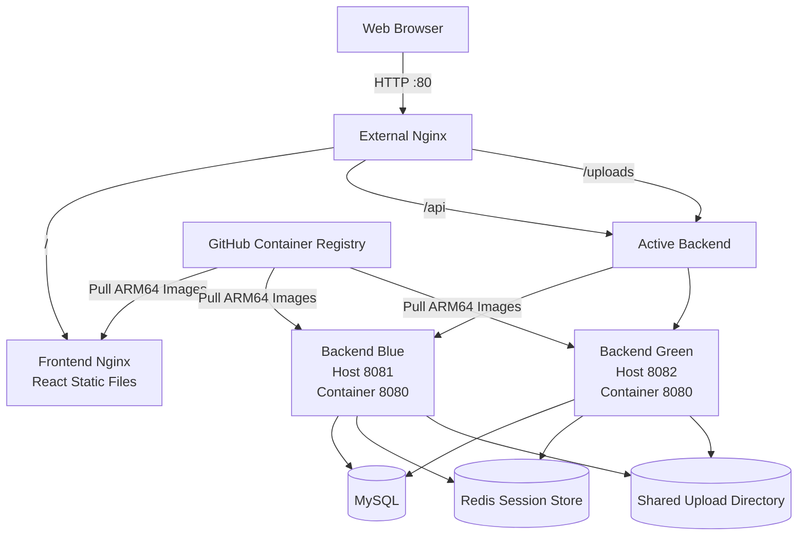

# AWS EC2 Deployment

## 1. Overview

This document describes how JihunPage is deployed and operated on an AWS EC2 instance.

JihunPage is a full-stack gallery service built with React and Spring Boot. The production environment uses Docker Compose, Nginx, MySQL, Redis, and prebuilt container images published to GitHub Container Registry.

The deployment environment was designed with the following goals:

- Run the application on an external production server
- Avoid building frontend and backend applications directly on the EC2 instance
- Deploy versioned container images from GHCR
- Support both AMD64 and ARM64 environments
- Maintain login sessions during backend traffic switching
- Verify Blue-Green deployment and rollback procedures
- Keep database, session, and uploaded image data persistent

The application is deployed on an ARM64-based AWS EC2 instance running Amazon Linux 2023.

Frontend and backend images are built through GitHub Actions and published to GHCR as multi-architecture images. The EC2 server pulls the images and starts the required containers using `compose.deploy.yaml`.

The production environment is currently accessible through the EC2 public IP address over HTTP port 80. A custom domain and HTTPS are not yet configured.

## 2. Deployment Architecture

Nginx acts as the single entry point for all external HTTP requests.

Requests are routed according to their URL paths:

- `/` is forwarded to the frontend Nginx container.
- `/api` is forwarded to the currently active Spring Boot backend.
- `/uploads` is forwarded to the currently active Spring Boot backend.

Two backend containers are defined for Blue-Green deployment:

- `backend-blue`
  - Container port: `8080`
  - EC2 host port: `8081`

- `backend-green`
  - Container port: `8080`
  - EC2 host port: `8082`

Only one backend receives external traffic at a time. The external Nginx upstream configuration determines whether Blue or Green is active.

Both backend containers share the same MySQL database, Redis session store, and upload directory. Therefore, application data, login sessions, and uploaded images remain available after traffic is switched between the backend environments.



The backend response includes an instance-identification header so that the active environment can be verified externally.

```text
X-Backend-Instance: backend-blue
```

or

```text
X-Backend-Instance: backend-green
```

The deployment scripts use this header together with HTTP health checks to verify that traffic has been switched to the expected backend instance.

## 3. AWS Resources

The JihunPage production environment is deployed in the AWS Seoul Region.

The following AWS resources and instance specifications are used:

| Resource         | Configuration           |
| ---------------- | ----------------------- |
| AWS Region       | Asia Pacific (Seoul)    |
| Compute Service  | Amazon EC2              |
| Instance Type    | `t4g.small`             |
| CPU Architecture | ARM64                   |
| Operating System | Amazon Linux 2023       |
| Memory           | Approximately 2 GiB     |
| Swap Space       | 2 GiB                   |
| Storage          | Amazon EBS `gp3` volume |
| Network Access   | EC2 public IPv4 address |
| Application Port | HTTP port `80`          |

The `t4g.small` instance uses an AWS Graviton processor based on the ARM64 architecture.

Because the first GHCR images only supported the AMD64 architecture, they could not run on the EC2 instance. The image publishing workflow was later updated to build both AMD64 and ARM64 images using Docker Buildx and QEMU.

The application is currently accessed through the EC2 public IPv4 address. A custom domain, HTTPS certificate, load balancer, and managed database service are not yet configured.

MySQL and Redis run as Docker containers on the same EC2 instance. This configuration was selected to keep the deployment architecture and operating costs manageable for a personal project.

## 4. Security Group

The EC2 security group allows only the ports required for administration and external web access.

### Inbound Rules

| Port | Protocol | Source                          | Purpose            |
| ---- | -------- | ------------------------------- | ------------------ |
| `22` | TCP      | Current administrator public IP | SSH access         |
| `80` | TCP      | `0.0.0.0/0`                     | Public HTTP access |

SSH access is restricted to the administrator's current public IP address instead of being exposed to all external networks.

HTTP port `80` is publicly accessible so that users can access the application through the external Nginx server.

The following service ports are not exposed through the EC2 security group:

| Port   | Service       |
| ------ | ------------- |
| `3306` | MySQL         |
| `6379` | Redis         |
| `8081` | Backend Blue  |
| `8082` | Backend Green |

MySQL, Redis, and both backend instances communicate only through the internal Docker network or the EC2 host.

External clients cannot directly access the database, session store, or backend application ports. All application requests enter through Nginx on port `80`.

When the administrator's network location changes, the public IP address permitted by the SSH rule must be updated. During deployment, an SSH timeout occurred after the administrator moved to a different network. The issue was resolved by replacing the previous SSH source IP with the new public IP address.

## 5. EC2 Initial Setup

The EC2 instance was accessed through SSH using the private key created when the instance was launched.

```bash
chmod 400 <private-key>.pem

ssh -i <private-key>.pem ec2-user@<ec2-public-ip>
```

The private key file permissions were restricted before connecting to prevent SSH from rejecting an overly accessible key file.

After connecting to the instance, the installed packages were updated and Git was installed.

```bash
sudo dnf update -y
sudo dnf install -y git
```

The operating system, CPU architecture, memory, and storage were checked before installing the application dependencies.

```bash
cat /etc/os-release
uname -m
free -h
df -h
```

The expected CPU architecture was `aarch64`, because the EC2 instance uses an ARM64-based AWS Graviton processor.

The initial server setup included the following components:

- Git
- Docker Engine
- Docker Compose
- 2 GiB swap space
- JihunPage repository
- Production environment variables
- Persistent directories for MySQL and uploaded images

Application source code was not built directly on the EC2 instance. The server only pulls the repository configuration and prebuilt container images from GHCR.

## 6. Docker and Docker Compose Installation

Docker was installed using the Amazon Linux 2023 package manager.

```bash
sudo dnf install -y docker
```

The Docker service was enabled so that it starts automatically when the EC2 instance boots. It was also started immediately.

```bash
sudo systemctl enable --now docker
```

The service status was checked after installation.

```bash
sudo systemctl status docker
```

The `ec2-user` account was added to the `docker` group so that Docker commands could be executed without `sudo`.

```bash
sudo usermod -aG docker ec2-user
```

The SSH session was disconnected and reconnected to apply the new group membership.

```bash
exit

ssh -i <private-key>.pem ec2-user@<ec2-public-ip>
```

Docker installation, Docker Compose, and the CPU architecture were verified with the following commands:

```bash
docker --version
docker compose version
uname -m
```

The EC2 instance returned the following results:

```text
Docker version 25.0.14, build 0bab007
Docker Compose version v5.1.4
aarch64
```

These results confirm that Docker and Docker Compose were installed correctly and that the application is running on an ARM64 environment.

The project therefore uses the following command format:

```bash
docker compose -f compose.deploy.yaml up -d
```

The legacy `docker-compose` command is not used.

During the initial setup, Docker commands failed because the Docker service had been installed but was not running. The issue was resolved by enabling and starting the service.

```bash
sudo systemctl enable --now docker
```

After the service was activated, Docker and Docker Compose commands operated normally.

## 7. Swap Configuration

The `t4g.small` instance has approximately 2 GiB of memory. Because the production environment runs MySQL, Redis, Nginx, the frontend, and one or two Spring Boot backend containers, a 2 GiB swap file was added to reduce the risk of processes being terminated when physical memory becomes temporarily insufficient.

A 2 GiB swap file was created with the following commands:

```bash
sudo fallocate -l 2G /swapfile
sudo chmod 600 /swapfile
sudo mkswap /swapfile
sudo swapon /swapfile
```

The file permission was restricted to `600` because the swap file may contain data that was previously stored in application memory.

The swap configuration was verified with the following commands:

```bash
free -h
swapon --show
```

To enable the swap file automatically after an EC2 restart, the following entry was added to `/etc/fstab`:

```bash
echo '/swapfile swap swap defaults 0 0' | sudo tee -a /etc/fstab
```

The configured swap file can be confirmed with:

```bash
grep swapfile /etc/fstab
```

After configuration, the server had approximately 2 GiB of physical memory and 2 GiB of swap space.

Swap was added as a safety measure rather than as a replacement for physical memory. During normal operation, only a small amount of swap space was used, and continuous swap-in or swap-out activity was not observed.

The inactive backend is normally stopped to reduce memory usage. Both Blue and Green backends are run simultaneously only while a new version is being deployed and verified.

## 8. Repository and Environment Setup

The JihunPage repository was cloned onto the EC2 instance to obtain the Docker Compose configuration, Nginx configuration, and deployment scripts.

```bash
git clone https://github.com/kho903/JihunPage.git
cd JihunPage
```

The `main` branch was updated before deployment.

```bash
git switch main
git pull origin main
```

The server does not build the frontend or backend application source code directly. The repository is used primarily for the following deployment files:

- `compose.deploy.yaml`
- Nginx configuration files
- Blue-Green deployment scripts
- Production environment configuration
- Persistent upload directory

A production environment file named `.env.deploy` was created in the project root.

```bash
touch .env.deploy
chmod 600 .env.deploy
```

The file contains environment-specific values required by Docker Compose, such as:

- MySQL database name
- MySQL username and password
- MySQL root password
- Redis configuration
- Backend and frontend image names
- GHCR image tag
- Application profile settings

The exact variable names must match the variables referenced in `compose.deploy.yaml`.

Example structure:

```dotenv
MYSQL_DATABASE=<database-name>
MYSQL_USER=<database-user>
MYSQL_PASSWORD=<database-password>
MYSQL_ROOT_PASSWORD=<root-password>

BACKEND_IMAGE=ghcr.io/kho903/jihunpage-backend
FRONTEND_IMAGE=ghcr.io/kho903/jihunpage-frontend
IMAGE_TAG=sha-<full-commit-sha>
```

Actual passwords and deployment secrets must not be committed to Git.

The `.env.deploy` file should be included in `.gitignore`, and only a template containing placeholder values should be shared through the repository.

```gitignore
.env.deploy
```

Before starting the containers, the upload directory used by the backend bind mount was created.

```bash
mkdir -p backend/uploads
```

The directory permissions were checked because the backend container runs as a non-root `spring` user.

```bash
ls -ld backend/uploads
```

The deployment configuration was reviewed before starting the application.

```bash
docker compose \
    --env-file .env.deploy \
    -f compose.deploy.yaml \
    config
```

This command validates the Docker Compose configuration and displays the resolved environment variables and service definitions without starting the containers.

Because the rendered output may contain sensitive values, it should not be copied into public logs or committed to the repository.

## 9. GHCR Image Deployment

The production server does not build the frontend or backend applications directly.
Instead, it pulls prebuilt container images from GitHub Container Registry.

The following images are published through GitHub Actions:

- `ghcr.io/kho903/jihunpage-backend`
- `ghcr.io/kho903/jihunpage-frontend`

Each image is published with the following tags:

- `latest`
- `sha-<full-commit-sha>`

Although the `latest` tag is convenient for testing, the production environment uses a commit SHA tag whenever possible.

Using a SHA-based tag makes it possible to identify the exact application version running on the server and prevents an existing deployment from changing unexpectedly when the `latest` tag is updated.

The image tag was configured in `.env.deploy`.

```dotenv
IMAGE_TAG=sha-<full-commit-sha>
```

The required images were pulled before starting the containers.

```bash
docker compose \
    --env-file .env.deploy \
    -f compose.deploy.yaml \
    pull
```

The downloaded images were verified with:

```bash
docker image ls
```

The production containers were then started in detached mode.

```bash
docker compose \
    --env-file .env.deploy \
    -f compose.deploy.yaml \
    up -d
```

The running container status was checked with:

```bash
docker compose \
    --env-file .env.deploy \
    -f compose.deploy.yaml \
    ps
```

Container logs were checked when a service failed to start or became unhealthy.

```bash
docker compose \
    --env-file .env.deploy \
    -f compose.deploy.yaml \
    logs --tail=100
```

Logs for a specific service can also be inspected separately.

```bash
docker compose \
    --env-file .env.deploy \
    -f compose.deploy.yaml \
    logs --tail=100 backend-blue
```

The frontend and backend images support both AMD64 and ARM64 platforms.

The initial images supported only `linux/amd64`, which caused the following error on the ARM64-based EC2 instance:

```text
no matching manifest for linux/arm64/v8
```

To resolve this issue, the GitHub Actions image publishing workflow was updated to use Docker QEMU and Buildx.

The images are currently built for the following platforms:

```text
linux/amd64
linux/arm64
```

As a result, the same image can run on Intel or AMD servers, Apple Silicon development machines, and AWS Graviton-based EC2 instances.

When GHCR authentication is required, the server can log in using a GitHub Personal Access Token with package read permission.

```bash
echo "<github-token>" | docker login ghcr.io \
    -u "<github-username>" \
    --password-stdin
```

The token must not be written directly into the repository, shell scripts, or public documentation.

## 10. Upload Directory Permissions

The backend stores uploaded gallery images in a directory bind-mounted from the EC2 host. The upload directory was created before starting the backend containers.

```bash
mkdir -p backend/uploads
```

The production backend image runs as a non-root `spring` user for security. However, the upload directory created on the EC2 instance was initially owned by `root`.

The directory ownership was checked with:

```bash
ls -ld backend/uploads
```

Because the backend process did not have permission to write to the bind-mounted directory, the application failed while initializing the gallery upload directory.

The backend image user configuration was inspected to identify the user running inside the container.

```bash
docker image inspect \
    ghcr.io/kho903/jihunpage-backend:<image-tag> \
    --format '{{.Config.User}}'
```

The user and group IDs inside the container can also be checked by running:

```bash
docker run --rm \
    --entrypoint id \
    ghcr.io/kho903/jihunpage-backend:<image-tag>
```

After confirming the UID and GID of the `spring` user, the ownership of the host upload directory was changed to match them.

```bash
sudo chown -R <spring-uid>:<spring-gid> backend/uploads
```

The directory ownership was then verified again.

```bash
ls -ld backend/uploads
```

After the ownership was corrected, the backend container was recreated.

```bash
docker compose \
    --env-file .env.deploy \
    -f compose.deploy.yaml \
    up -d --force-recreate backend-blue
```

The backend logs were checked to confirm that the upload directory was initialized successfully.

```bash
docker compose \
    --env-file .env.deploy \
    -f compose.deploy.yaml \
    logs --tail=100 backend-blue
```

Image upload and deletion were then tested through the deployed application.

This issue occurred because bind-mounted directories retain the ownership and permissions of the EC2 host. Running the backend as a non-root user improves container security, but the host directory must grant that user the required write permissions.

The directory should not be made globally writable with permissions such as `777`. Matching the directory ownership to the container user provides the required access without granting unnecessary permissions.

## 11. Blue-Green Deployment Verification

The production environment defines two Spring Boot backend containers for Blue-Green deployment.

- `backend-blue`: EC2 host port `8081`
- `backend-green`: EC2 host port `8082`

Only one backend receives external traffic through Nginx at a time. The inactive backend is used to start and verify a new application version before traffic is switched.

The currently active backend was checked with:

```bash
./scripts/detect-environment.sh active
```

The inactive backend can also be checked with:

```bash
./scripts/detect-environment.sh inactive
```

Before switching traffic, the target backend was started with the new GHCR image.

```bash
docker compose \
    --env-file .env.deploy \
    -f compose.deploy.yaml \
    up -d --force-recreate backend-green
```

The target backend was verified directly through its EC2 host port.

```bash
curl -i http://localhost:8082/api/health
```

The health-check script verified both the HTTP response and the expected backend instance header.

```bash
./scripts/health-check.sh green
```

The expected response header was:

```text
X-Backend-Instance: backend-green
```

After the target backend passed the health check, Nginx traffic was switched to the new environment.

```bash
./scripts/switch-backend.sh green
```

The script performs the following operations:

1. Checks the health of the target backend
2. Backs up the current Nginx upstream configuration
3. Replaces the active backend configuration
4. Runs `nginx -t`
5. Reloads Nginx
6. Verifies the externally returned backend instance header
7. Restores the previous configuration if verification fails

The externally active backend was verified through Nginx.

```bash
curl -I http://localhost/api/health
```

The response was checked for the expected header:

```text
X-Backend-Instance: backend-green
```

The following application behavior was tested after switching traffic:

- The application remained accessible through HTTP port `80`
- The login session remained valid after the backend switch
- MySQL data remained available
- Previously uploaded gallery images remained available
- New image uploads and deletions continued to work
- Requests were handled by the newly activated backend

Login sessions were preserved because both Blue and Green backends use the same Redis instance through Spring Session.

Application data was preserved because both backends share the same MySQL database and upload directory.

If the newly activated backend fails after deployment, traffic can be returned to the previous environment with:

```bash
./scripts/rollback.sh
```

During normal operation, the inactive backend is stopped to reduce memory usage.

```bash
docker compose \
    --env-file .env.deploy \
    -f compose.deploy.yaml \
    stop backend-blue
```

Both backends are run simultaneously only during deployment verification and traffic switching.

## 12. Resource Usage

The production environment runs on a `t4g.small` EC2 instance with approximately 2 GiB of physical memory and 2 GiB of swap space.

Resource usage was measured in two operating states:

- Only the active backend running
- Both Blue and Green backends running during deployment verification

The following commands were used to inspect the server resources:

```bash
free -h
docker stats --no-stream
vmstat 1 5
```

When only one backend was running, approximately `596 MiB` of memory remained available.

```text
Available memory: approximately 596 MiB
Swap usage: approximately 4 MiB
```

When both Blue and Green backends were running, approximately `398 MiB` of memory remained available.

```text
Available memory: approximately 398 MiB
Swap usage: approximately 7 MiB
```

The approximate memory usage of each container was:

| Container     |            Memory Usage |
| ------------- | ----------------------: |
| MySQL         | Approximately `474 MiB` |
| Backend Blue  | Approximately `272 MiB` |
| Backend Green | Approximately `243 MiB` |
| Redis         |  Approximately `10 MiB` |
| Frontend      |   Approximately `6 MiB` |
| Nginx         |   Approximately `4 MiB` |

MySQL used the largest amount of memory among the containers. Each Spring Boot backend also required approximately `240–270 MiB`.

CPU usage remained low during normal operation, and the CPU idle percentage was generally between `94%` and `100%`.

The `vmstat` results did not show continuous swap-in or swap-out activity. This indicated that the swap file was available as a safety measure but was not being heavily used during normal operation.

Because running both backend containers increases memory usage, the inactive backend is stopped after deployment verification.

This operating strategy allows the application to use Blue-Green deployment on a small EC2 instance while reducing unnecessary memory consumption during normal operation.

## 13. Troubleshooting

### 13.1 SSH Connection Timeout

#### Problem

The SSH connection to the EC2 instance timed out after the administrator moved from one network to another.

#### Cause

The EC2 security group allowed SSH access only from the previous public IP address.
After the network changed, the administrator's public IP address also changed.

#### Resolution

The SSH inbound rule was updated to allow port `22` from the new public IP address.

SSH access was then verified again:

```bash
ssh -i <private-key>.pem ec2-user@<ec2-public-ip>
```

Restricting SSH access to a specific public IP reduces unnecessary external exposure, but the rule must be updated whenever the administrator's public IP changes.

### 13.2 Docker Service Not Running

#### Problem

Docker commands failed immediately after Docker was installed.

#### Cause

The Docker package was installed, but the Docker service had not been started.

#### Resolution

The Docker service was enabled and started with:

```bash
sudo systemctl enable --now docker
```

The service status was then checked:

```bash
sudo systemctl status docker
```

This configuration also ensures that Docker starts automatically when the EC2 instance restarts.

### 13.3 Upload Directory Permission Error

#### Problem

The backend failed to initialize the gallery upload directory and could not save uploaded images.

#### Cause

The backend container runs as a non-root `spring` user, but the bind-mounted `backend/uploads` directory on the EC2 host was owned by `root`.

#### Resolution

The UID and GID of the container user were identified, and the host directory ownership was changed to match them.

```bash
docker run --rm \
    --entrypoint id \
    ghcr.io/kho903/jihunpage-backend:<image-tag>
```

```bash
sudo chown -R <spring-uid>:<spring-gid> backend/uploads
```

After the backend container was recreated, image upload and deletion worked normally.

### 13.4 ARM64 Image Manifest Error

#### Problem

The GHCR images could not be started on the AWS Graviton-based EC2 instance.

```text
no matching manifest for linux/arm64/v8
```

#### Cause

The original Docker images supported only the `linux/amd64` platform, while the `t4g.small` EC2 instance uses the ARM64 architecture.

#### Resolution

The GitHub Actions image publishing workflow was updated to use QEMU and Docker Buildx.

The images are now built for:

```text
linux/amd64
linux/arm64
```

The same images can therefore run on Intel or AMD servers, Apple Silicon development machines, and AWS Graviton-based EC2 instances.

### 13.5 Frontend Port 5173 Unavailable

#### Problem

The application could not be accessed through `localhost:5173` in the production environment.

#### Cause

Port `5173` is used by the Vite development server. The production frontend is built in advance and served as static files by an Nginx container.

The production environment does not run the Vite development server or expose port `5173`.

#### Resolution

The deployed application was accessed through the external Nginx server on HTTP port `80`.

```text
http://<ec2-public-ip>
```

This behavior is expected in the production environment.

### 13.6 Login Session Lost During Backend Switching

#### Problem

When backend sessions were stored only in application memory, the login state could not be shared between Blue and Green backend instances.

#### Cause

Each backend instance maintained its own independent in-memory HTTP session. A session created by Blue was therefore unavailable when traffic was switched to Green.

#### Resolution

Spring Session Data Redis was introduced so that both backend instances use the same external session store.

The login member ID is stored in the HTTP session using the following key:

```text
LOGIN_MEMBER_ID
```

The Redis namespace is:

```text
jihunpage:session
```

After this change, the login session remained valid when traffic was switched between Blue and Green.

### 13.7 Limited Memory on the EC2 Instance

#### Problem

Running MySQL, Redis, Nginx, the frontend, and both backend containers on a 2 GiB EC2 instance raised concerns about memory exhaustion.

#### Resolution

A 2 GiB swap file was added, and resource usage was measured using:

```bash
free -h
docker stats --no-stream
vmstat 1 5
```

Continuous swap-in or swap-out activity was not observed during testing.

To reduce memory consumption, only the active backend remains running during normal operation. The inactive backend is started temporarily during deployment verification and traffic switching.

## 14. Operation Commands

This section summarizes the commands commonly used to operate and inspect the JihunPage production environment.

All commands should be executed from the JihunPage project root unless otherwise specified.

### 14.1 Update Deployment Configuration

Update the local `main` branch before applying configuration changes:

```bash
git switch main
git pull origin main
```

Review the resolved Docker Compose configuration:

```bash
docker compose \
    --env-file .env.deploy \
    -f compose.deploy.yaml \
    config
```

Because this output may contain sensitive environment values, it should not be copied into public logs.

### 14.2 Pull Deployment Images

Pull the frontend and backend images configured in `.env.deploy`:

```bash
docker compose \
    --env-file .env.deploy \
    -f compose.deploy.yaml \
    pull
```

List the downloaded Docker images:

```bash
docker image ls
```

### 14.3 Check Container Status

Check the status of all production containers:

```bash
docker compose \
    --env-file .env.deploy \
    -f compose.deploy.yaml \
    ps
```

Check running Docker containers:

```bash
docker ps
```

### 14.4 Inspect Container Logs

Display recent logs from all services:

```bash
docker compose \
    --env-file .env.deploy \
    -f compose.deploy.yaml \
    logs --tail=100
```

Display logs from a specific backend:

```bash
docker compose \
    --env-file .env.deploy \
    -f compose.deploy.yaml \
    logs --tail=100 backend-blue
```

Follow backend logs in real time:

```bash
docker compose \
    --env-file .env.deploy \
    -f compose.deploy.yaml \
    logs -f backend-blue
```

### 14.5 Check Blue-Green Environments

Check the currently active backend:

```bash
./scripts/detect-environment.sh active
```

Check the inactive backend:

```bash
./scripts/detect-environment.sh inactive
```

Check both backend environments:

```bash
./scripts/detect-environment.sh all
```

Run a health check for Blue:

```bash
./scripts/health-check.sh blue
```

Run a health check for Green:

```bash
./scripts/health-check.sh green
```

### 14.6 Deploy a New Backend Version

Run the automated Blue-Green deployment script:

```bash
./scripts/deploy.sh
```

The deployment script recreates the inactive backend using the configured image, performs a health check, and switches Nginx traffic after verification succeeds.

After deployment, confirm the active environment:

```bash
./scripts/detect-environment.sh active
```

The externally returned backend instance can also be checked with:

```bash
curl -I http://localhost/api/health
```

Expected response header:

```text
X-Backend-Instance: backend-blue
```

or:

```text
X-Backend-Instance: backend-green
```

### 14.7 Switch Traffic Manually

Switch traffic to Blue:

```bash
./scripts/switch-backend.sh blue
```

Switch traffic to Green:

```bash
./scripts/switch-backend.sh green
```

Traffic should only be switched after the target backend passes its health check.

### 14.8 Roll Back a Deployment

Return traffic to the previously inactive backend:

```bash
./scripts/rollback.sh
```

After rollback, verify the active backend and external response header:

```bash
./scripts/detect-environment.sh active
curl -I http://localhost/api/health
```

### 14.9 Stop the Inactive Backend

To reduce memory usage, the inactive backend can be stopped after deployment verification.

Example for Blue:

```bash
docker compose \
    --env-file .env.deploy \
    -f compose.deploy.yaml \
    stop backend-blue
```

Example for Green:

```bash
docker compose \
    --env-file .env.deploy \
    -f compose.deploy.yaml \
    stop backend-green
```

The active backend must be confirmed before stopping either container.

### 14.10 Check Server Resources

Check physical memory and swap usage:

```bash
free -h
```

Check container resource usage:

```bash
docker stats --no-stream
```

Check CPU, memory, and swap activity:

```bash
vmstat 1 5
```

Check disk usage:

```bash
df -h
```

### 14.11 Restart the Production Environment

Restart the currently running containers:

```bash
docker compose \
    --env-file .env.deploy \
    -f compose.deploy.yaml \
    restart
```

A full recreation should be performed carefully because it may start both backend environments or temporarily affect the active service.

Before executing operational commands, the current active backend, container status, and `.env.deploy` image tag should be checked.

## 15. Limitations
