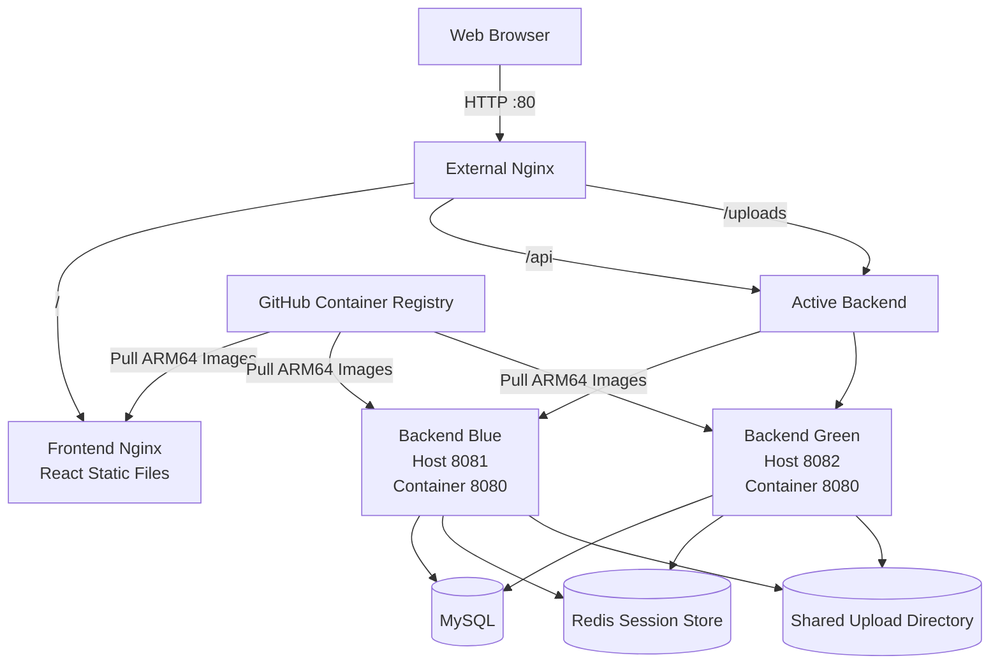

# AWS EC2 Deployment

## 1. Overview

This document describes how JihunPage is deployed and operated on an AWS EC2 instance.

JihunPage is a full-stack gallery service built with React and Spring Boot. The production environment uses Docker Compose, Nginx, MySQL, Redis, and prebuilt container images published to GitHub Container Registry.

The deployment environment was designed with the following goals:

- Run the application on an external production server
- Avoid building frontend and backend applications directly on the EC2 instance
- Deploy versioned container images from GHCR
- Support both AMD64 and ARM64 environments
- Maintain login sessions during backend traffic switching
- Verify Blue-Green deployment and rollback procedures
- Keep database, session, and uploaded image data persistent

The application is deployed on an ARM64-based AWS EC2 instance running Amazon Linux 2023.

Frontend and backend images are built through GitHub Actions and published to GHCR as multi-architecture images. The EC2 server pulls the images and starts the required containers using `compose.deploy.yaml`.

The production environment is currently accessible through the EC2 public IP address over HTTP port 80. A custom domain and HTTPS are not yet configured.

## 2. Deployment Architecture

Nginx acts as the single entry point for all external HTTP requests.

Requests are routed according to their URL paths:

- `/` is forwarded to the frontend Nginx container.
- `/api` is forwarded to the currently active Spring Boot backend.
- `/uploads` is forwarded to the currently active Spring Boot backend.

Two backend containers are defined for Blue-Green deployment:

- `backend-blue`
  - Container port: `8080`
  - EC2 host port: `8081`

- `backend-green`
  - Container port: `8080`
  - EC2 host port: `8082`

Only one backend receives external traffic at a time. The external Nginx upstream configuration determines whether Blue or Green is active.

Both backend containers share the same MySQL database, Redis session store, and upload directory. Therefore, application data, login sessions, and uploaded images remain available after traffic is switched between the backend environments.



The backend response includes an instance-identification header so that the active environment can be verified externally.

```text
X-Backend-Instance: backend-blue
```

or

```text
X-Backend-Instance: backend-green
```

The deployment scripts use this header together with HTTP health checks to verify that traffic has been switched to the expected backend instance.

## 3. AWS Resources

The JihunPage production environment is deployed in the AWS Seoul Region.

The following AWS resources and instance specifications are used:

| Resource         | Configuration           |
| ---------------- | ----------------------- |
| AWS Region       | Asia Pacific (Seoul)    |
| Compute Service  | Amazon EC2              |
| Instance Type    | `t4g.small`             |
| CPU Architecture | ARM64                   |
| Operating System | Amazon Linux 2023       |
| Memory           | Approximately 2 GiB     |
| Swap Space       | 2 GiB                   |
| Storage          | Amazon EBS `gp3` volume |
| Network Access   | EC2 public IPv4 address |
| Application Port | HTTP port `80`          |

The `t4g.small` instance uses an AWS Graviton processor based on the ARM64 architecture.

Because the first GHCR images only supported the AMD64 architecture, they could not run on the EC2 instance. The image publishing workflow was later updated to build both AMD64 and ARM64 images using Docker Buildx and QEMU.

The application is currently accessed through the EC2 public IPv4 address. A custom domain, HTTPS certificate, load balancer, and managed database service are not yet configured.

MySQL and Redis run as Docker containers on the same EC2 instance. This configuration was selected to keep the deployment architecture and operating costs manageable for a personal project.

## 4. Security Group

The EC2 security group allows only the ports required for administration and external web access.

### Inbound Rules

| Port | Protocol | Source                          | Purpose            |
| ---- | -------- | ------------------------------- | ------------------ |
| `22` | TCP      | Current administrator public IP | SSH access         |
| `80` | TCP      | `0.0.0.0/0`                     | Public HTTP access |

SSH access is restricted to the administrator's current public IP address instead of being exposed to all external networks.

HTTP port `80` is publicly accessible so that users can access the application through the external Nginx server.

The following service ports are not exposed through the EC2 security group:

| Port   | Service       |
| ------ | ------------- |
| `3306` | MySQL         |
| `6379` | Redis         |
| `8081` | Backend Blue  |
| `8082` | Backend Green |

MySQL, Redis, and both backend instances communicate only through the internal Docker network or the EC2 host.

External clients cannot directly access the database, session store, or backend application ports. All application requests enter through Nginx on port `80`.

When the administrator's network location changes, the public IP address permitted by the SSH rule must be updated. During deployment, an SSH timeout occurred after the administrator moved to a different network. The issue was resolved by replacing the previous SSH source IP with the new public IP address.

## 5. EC2 Initial Setup

The EC2 instance was accessed through SSH using the private key created when the instance was launched.

```bash
chmod 400 <private-key>.pem

ssh -i <private-key>.pem ec2-user@<ec2-public-ip>
```

The private key file permissions were restricted before connecting to prevent SSH from rejecting an overly accessible key file.

After connecting to the instance, the installed packages were updated and Git was installed.

```bash
sudo dnf update -y
sudo dnf install -y git
```

The operating system, CPU architecture, memory, and storage were checked before installing the application dependencies.

```bash
cat /etc/os-release
uname -m
free -h
df -h
```

The expected CPU architecture was `aarch64`, because the EC2 instance uses an ARM64-based AWS Graviton processor.

The initial server setup included the following components:

- Git
- Docker Engine
- Docker Compose
- 2 GiB swap space
- JihunPage repository
- Production environment variables
- Persistent directories for MySQL and uploaded images

Application source code was not built directly on the EC2 instance. The server only pulls the repository configuration and prebuilt container images from GHCR.

## 6. Docker and Docker Compose Installation

Docker was installed using the Amazon Linux 2023 package manager.

```bash
sudo dnf install -y docker
```

The Docker service was enabled so that it starts automatically when the EC2 instance boots. It was also started immediately.

```bash
sudo systemctl enable --now docker
```

The service status was checked after installation.

```bash
sudo systemctl status docker
```

The `ec2-user` account was added to the `docker` group so that Docker commands could be executed without `sudo`.

```bash
sudo usermod -aG docker ec2-user
```

The SSH session was disconnected and reconnected to apply the new group membership.

```bash
exit

ssh -i <private-key>.pem ec2-user@<ec2-public-ip>
```

Docker installation, Docker Compose, and the CPU architecture were verified with the following commands:

```bash
docker --version
docker compose version
uname -m
```

The EC2 instance returned the following results:

```text
Docker version 25.0.14, build 0bab007
Docker Compose version v5.1.4
aarch64
```

These results confirm that Docker and Docker Compose were installed correctly and that the application is running on an ARM64 environment.

The project therefore uses the following command format:

```bash
docker compose -f compose.deploy.yaml up -d
```

The legacy `docker-compose` command is not used.

During the initial setup, Docker commands failed because the Docker service had been installed but was not running. The issue was resolved by enabling and starting the service.

```bash
sudo systemctl enable --now docker
```

After the service was activated, Docker and Docker Compose commands operated normally.

## 7. Swap Configuration

The `t4g.small` instance has approximately 2 GiB of memory. Because the production environment runs MySQL, Redis, Nginx, the frontend, and one or two Spring Boot backend containers, a 2 GiB swap file was added to reduce the risk of processes being terminated when physical memory becomes temporarily insufficient.

A 2 GiB swap file was created with the following commands:

```bash
sudo fallocate -l 2G /swapfile
sudo chmod 600 /swapfile
sudo mkswap /swapfile
sudo swapon /swapfile
```

The file permission was restricted to `600` because the swap file may contain data that was previously stored in application memory.

The swap configuration was verified with the following commands:

```bash
free -h
swapon --show
```

To enable the swap file automatically after an EC2 restart, the following entry was added to `/etc/fstab`:

```bash
echo '/swapfile swap swap defaults 0 0' | sudo tee -a /etc/fstab
```

The configured swap file can be confirmed with:

```bash
grep swapfile /etc/fstab
```

After configuration, the server had approximately 2 GiB of physical memory and 2 GiB of swap space.

Swap was added as a safety measure rather than as a replacement for physical memory. During normal operation, only a small amount of swap space was used, and continuous swap-in or swap-out activity was not observed.

The inactive backend is normally stopped to reduce memory usage. Both Blue and Green backends are run simultaneously only while a new version is being deployed and verified.

## 8. Repository and Environment Setup

## 9. GHCR Image Deployment

## 10. Upload Directory Permissions

## 11. Blue-Green Deployment Verification

## 12. Resource Usage

## 13. Troubleshooting

## 14. Operation Commands

## 15. Limitations
