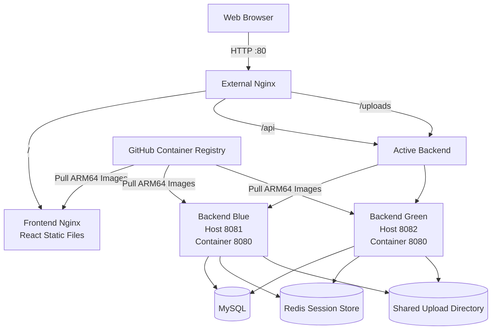

# AWS EC2 Deployment

## 1. Overview

This document describes how JihunPage is deployed and operated on an AWS EC2 instance.

JihunPage is a full-stack gallery service built with React and Spring Boot. The production environment uses Docker Compose, Nginx, MySQL, Redis, and prebuilt container images published to GitHub Container Registry.

The deployment environment was designed with the following goals:

- Run the application on an external production server
- Avoid building frontend and backend applications directly on the EC2 instance
- Deploy versioned container images from GHCR
- Support both AMD64 and ARM64 environments
- Maintain login sessions during backend traffic switching
- Verify Blue-Green deployment and rollback procedures
- Keep database, session, and uploaded image data persistent

The application is deployed on an ARM64-based AWS EC2 instance running Amazon Linux 2023.

Frontend and backend images are built through GitHub Actions and published to GHCR as multi-architecture images. The EC2 server pulls the images and starts the required containers using `compose.deploy.yaml`.

The production environment is currently accessible through the EC2 public IP address over HTTP port 80. A custom domain and HTTPS are not yet configured.

## 2. Deployment Architecture

Nginx acts as the single entry point for all external HTTP requests.

Requests are routed according to their URL paths:

- `/` is forwarded to the frontend Nginx container.
- `/api` is forwarded to the currently active Spring Boot backend.
- `/uploads` is forwarded to the currently active Spring Boot backend.

Two backend containers are defined for Blue-Green deployment:

- `backend-blue`
  - Container port: `8080`
  - EC2 host port: `8081`

- `backend-green`
  - Container port: `8080`
  - EC2 host port: `8082`

Only one backend receives external traffic at a time. The external Nginx upstream configuration determines whether Blue or Green is active.

Both backend containers share the same MySQL database, Redis session store, and upload directory. Therefore, application data, login sessions, and uploaded images remain available after traffic is switched between the backend environments.



The backend response includes an instance-identification header so that the active environment can be verified externally.

```text
X-Backend-Instance: backend-blue
```

or

```text
X-Backend-Instance: backend-green
```

The deployment scripts use this header together with HTTP health checks to verify that traffic has been switched to the expected backend instance.

## 3. AWS Resources

## 4. Security Group

## 5. EC2 Initial Setup

## 6. Docker and Docker Compose Installation

## 7. Swap Configuration

## 8. Repository and Environment Setup

## 9. GHCR Image Deployment

## 10. Upload Directory Permissions

## 11. Blue-Green Deployment Verification

## 12. Resource Usage

## 13. Troubleshooting

## 14. Operation Commands

## 15. Limitations
